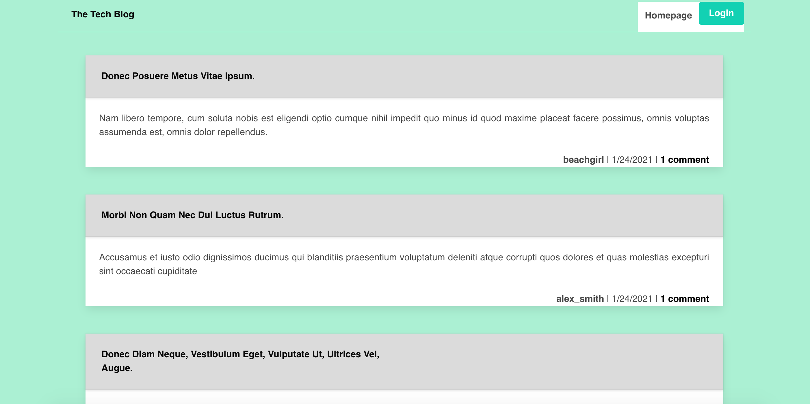

# Techblog

## Description

This blog allows users to create an account that they can sign into and create or delete posts from.

https://radiant-mesa-62821.herokuapp.com/

## Installation

Must have MySQL2, Dotenv, Handlebars, Sequelize, and Express installed

Clone to computer and seed database

create .env file and add the following:

DB_NAME='tech_blog_db'

DB_USER='root'

DB_PW='XXX'
